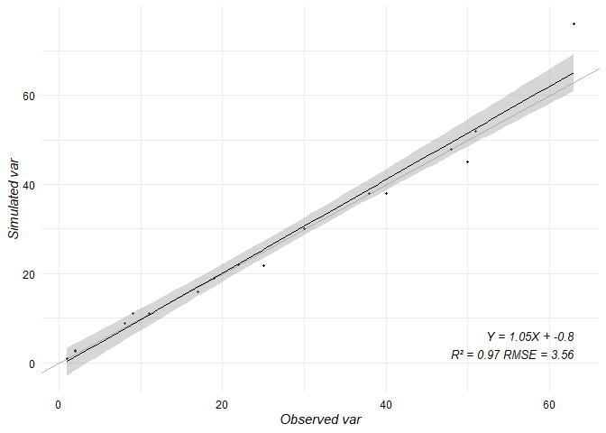

<!-- README.md is generated from README.Rmd. Please edit that file -->

# [rstep](https://vezy.github.io/DynACof): a workflow for STEP (Sahelian Transpiration Evaporation and Productivity) model under R 

<!-- badges: start -->

[](https://github.com/MadoShi64/rstep/actions)
[](https://app.codecov.io/gh/MadoShi64/rstep?branch=master)
<!-- badges: end -->

## Overview

rstep provides simple functions to automatize the different tasks when
performing 1D or 2D STEP [(Mougin et
al. 1995)](https://www.sciencedirect.com/science/article/abs/pii/0034425794001268)
simulation. It prepares the input data (meteo (file.mto), sol
(file.sol), animal load (file.cha), vegetation (file.veg)…) for STEP
simulation, by cleaning and formatting the data. It provides a simple
workflow for the model parametrization and calibration, with a set of
functions to automatize the visualisation of the model outputs (1D:
plots and 2D: maps), using several functions some of which come from
other packages in the R environment.

## Installation

The development version of rstep can be installed from GitHub:

``` r
install.packages("remotes")
remotes::install_github("MadoShi64/rstep")
```

## Some examples

Calling a STEP soil file for formatting

``` r
rstep::sol
#> Warning in as.POSIXlt.POSIXct(Sys.time()): unable to identify current timezone 'C':
#> please set environment variable 'TZ'
#> # A tibble: 11 × 7
#>    X1                            ...2               ...3  ...4  ...5  ...6 ...7 
#>    <chr>                         <chr>             <dbl> <dbl> <dbl> <dbl> <chr>
#>  1 <NA>                          SITE RSP_six_for…  NA    NA    NA    NA   <NA> 
#>  2 <NA>                          ZONE SAHELIENNE …  NA    NA    NA    NA   <NA> 
#>  3 <NA>                          0.29648000000000…  NA    NA    NA    NA   ! al…
#>  4 <NA>                          2                  28    70   200    NA   ! ep…
#>  5 <NA>                          0.6                36.4  71.4 156    NA   ! st…
#>  6 <NA>                          17.87              22.8  25.2  28.5  30.5 ! Te…
#>  7 caracteristiques sol deduites <NA>               NA    NA    NA    NA   ! Op…
#>  8 <NA>                          5                   4     4     4    NA   ! % …
#>  9 <NA>                          93                 93    92    92    NA   ! % …
#> 10 <NA>                          7.4                 7.2   7.5   7.5  NA   ! pH 
#> 11 <NA>                          2                   3     4     4    NA   ! pe…
```

An example showing how to perform a linear regression, display the graph
and metrics with one line of code (example with a random dataset.)

``` r
library(rstep)

set.seed(15)
var = abs(rnorm(30)) # observation
var.simu = abs(rnorm(30)) # simulation

# create data frame
data = data.frame(var,var.simu) 

# Plot the graph of the regression
step_reg(data,"var","plot")
#> `geom_smooth()` using formula 'y ~ x'
```



``` r
# Check the metrics of the linear regression 
step_reg(data,"var","metric")
#>   r.squared      rmse       mae accuracy       bias
#> 1 0.1652742 0.8668114 0.6749571        0 -0.1425967
```
